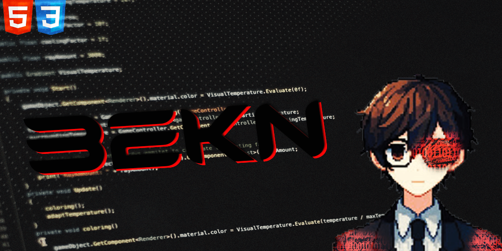

# 
Bekn-bio

> A small sample project to share in my
GitHub

## 🤝 Colaboradores

Agradecemos às seguintes pessoas que contribuíram para este projeto:

<table>
  <tr>
    <td align="center">
      <a href="#">
         
        
          <b>Wk86</b>
        
      </a>
    </td>
    <td align="center">
      <a href="#">
         
        
          <b>Bekn</b>
        
      </a>
    </td>
  </tr>
</table>
